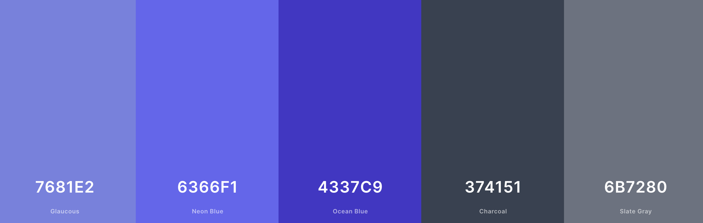

# Piggy Bank
​
## Team Name: <<team_name>>
​
[Link to Deployed Project](<<add_deployed_link_to_project_here>>)
​
## Contents(#contents)
​
* [About](#about)
  * [Target Audience](#targe-audience)
* [User Experience (UX)](#user-experience)
    * [User Stories](#user-stories)
* [Technology](#technology)
* [Design](#design)
  * [Color Scheme](#color-scheme)
  * [Typography](#typography)
  * [Imagery](#imagery)
  * [Wireframes](#wireframes)
* [Deployment & Usage](#deployment)
* [Testing](#testing)
* [Credits](#credits)
  * [Code](#code)
  * [Content](#content)
  * [Media](#media)
  * [Acknowledgements](#acknowledgements)
​
## About
This interactive web application is designed to help the user save money through each banking transaction. The app rounds down the change to the nearest whole currency and deposits the amount in a separate 'piggy bank' linked to a bank account of their choice using the account's IBAN.

Clicking the 'login' button will prompt the user to enter their credentials (username and password) and pass through a two-factor authentication before arriving to their personal dashboard. There they will be able to view previous transactions, view the account balance and toggle between categorized piggy banks. 

### Target Audience
Piggy Bank is designed for users with access to a bank account who want to save money after each transaction. Adults and children alike can interact with this easy-to-use application and track their savings through one or more accounts.

## User Experience
Our team thought about various banking apps already in use today to consider what featues we wanted Piggy Bank to have. What features are current applications lacking? How could they be improved? What do we want the main functionality of Piggy Bank to be? 

Ultimately, we wanted an easy-to-use web application that allows the user to deposit, transfer and withdraw money safely and without issue. The simplicity of the app also caters to younger users and those who are just learning the ins and outs of online banking. 
​
### User stories
Four categories of User Stories were used to plan the implementation of various features for the Piggy Bank App. They were prioritized as: "Must Have", "Should Have", "Could Have" and "Won't Have". 

All categories of User Stories were included in the fnial deployment of this version of the Piggy Bank Application, barring those labeled "Won't Have". They were not prioritized during the creation and deployment of this version of the app but may be included as future features.

The image below shows a template to create User Stories that will include the name of the Story, a brief descritpion, its title, one of four labels and what team member the Story is assigned to. 

The User Stories included in this edition of the app are:

|User Story |Image of the User Story completed|Label|
|-----------------------|---------------------------------|-----------
|[#1](https://github.com/Kaylaesmith1/jan23-hackathon-team12/issues/1) Create a new account| |Must Have||
|[#2](https://github.com/Kaylaesmith1/jan23-hackathon-team12/issues/2) Transfer money| |Must Have||
|[#3](https://github.com/Kaylaesmith1/jan23-hackathon-team12/issues/3) Check the account balance| |Must Have||
|[#4](https://github.com/Kaylaesmith1/jan23-hackathon-team12/issues/4) Deposit money| |Must Have||
|[#5](https://github.com/Kaylaesmith1/jan23-hackathon-team12/issues/5) Contact customer service| |Should Have||
|[#6](https://github.com/Kaylaesmith1/jan23-hackathon-team12/issues/6) Terms and Conditions| |Must Have||
|[#7](https://github.com/Kaylaesmith1/jan23-hackathon-team12/issues/7) Direct debit| |Could Have||
|[#8](https://github.com/Kaylaesmith1/jan23-hackathon-team12/issues/8) Make deposits using (the test version of) Stripe| |Must Have||
|[#9](https://github.com/Kaylaesmith1/jan23-hackathon-team12/issues/9) Footer with professional links| |Must Have||
|[#10](https://github.com/Kaylaesmith1/jan23-hackathon-team12/issues/10) Two-factor authentication| |Must Have||
|[#11](https://github.com/Kaylaesmith1/jan23-hackathon-team12/issues/11) Home page | |Must Have||
|[#12](https://github.com/Kaylaesmith1/jan23-hackathon-team12/issues/12) Login | |Must Have||
|[#13](https://github.com/Kaylaesmith1/jan23-hackathon-team12/issues/13) Separate deposits and withdrawals | |Must Have||

## Technology:
​
<< Detail your techstack here, and why you chose it. >>
​
<< list your languages & tools below: >>
​
*  << languages >>
	* << list the langauge & reason for using it >>
​
* << tools >>
  * << list the tool & reason for using it >>
​
## Initial MVP idea:
​
Detail plans and scope of project here....
​
<< consider talking about how you planned as a team here and what tools were implemented >>
​
### Actual idea & content:
​
<< how does you final product/project match up to your initial mvp plans >>
​
<< detail idea / features / functionality here >>
​
## Design
​
### Color Scheme:
Our team decided on a royal blue color scheme with gray / silver accents to make it look professional yet entice users. The 5-color scheme is below.

​

### Typography:
<< what font pairings did your team consider and pick? And why? >>
​
### Imagery:
<< Detail imagery used to compliment your build & theme >>
​
<< ensure source attribution is maintained, and that you have used copyright free material >>
​
### Wireframes:
​

- Mobile Wireframes:

​
<< put all your mobile wireframes here... >>
​
<< consider adding some notes to detail the planned components or functionality >>
​

​

- Desktop Wireframes:

​
<< put all your mobile wireframes here... >>
​
<< consider adding some notes to detail the planned components or functionality >>
​

## Deployment
<< detail deployment methods used here, and any extraneous circumstances to run the project locally >>
​
## Testing
<< detail testing logs here - any known bugs, and squashed bugs 🐛🐛 >>
​
## Credits
​
### Code
<< any and all code that isn't yours...must go here >>
​
### Content
<< any content, such as facts/references/text that isn't yours...must go here >>
​
### Media
<< you may have already done this above in the Imagery section, but just in case, please attribute Media acquisition here >>
​
### Acknowledgements
<< personal thanks and praise 🙌 >>