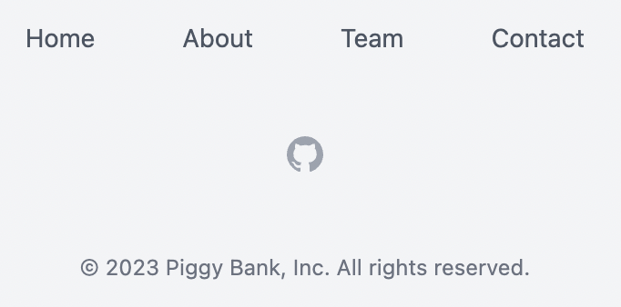
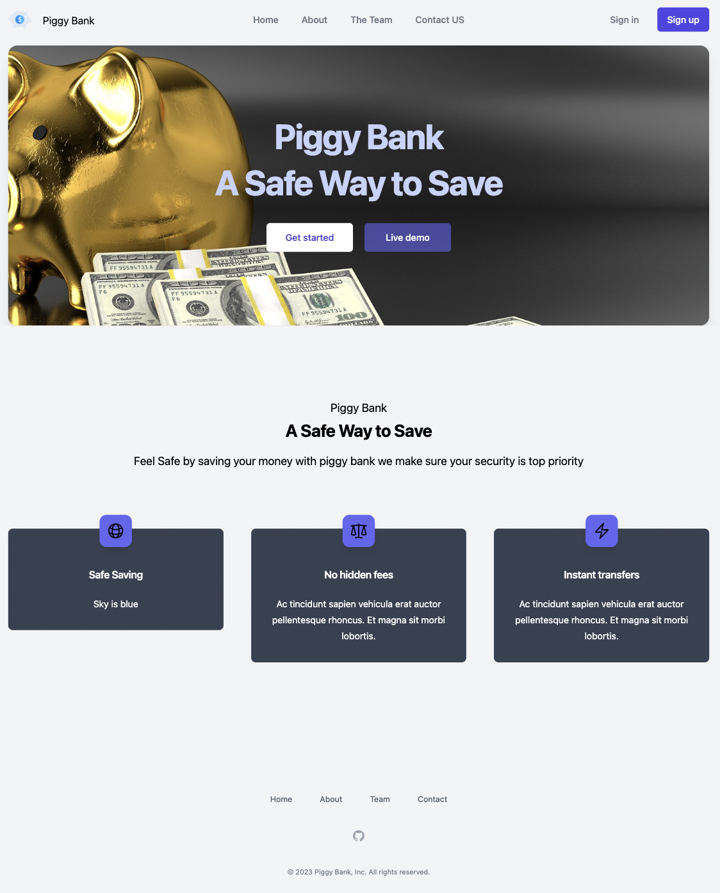
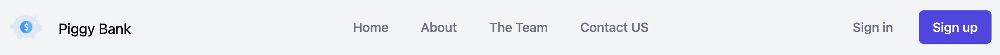
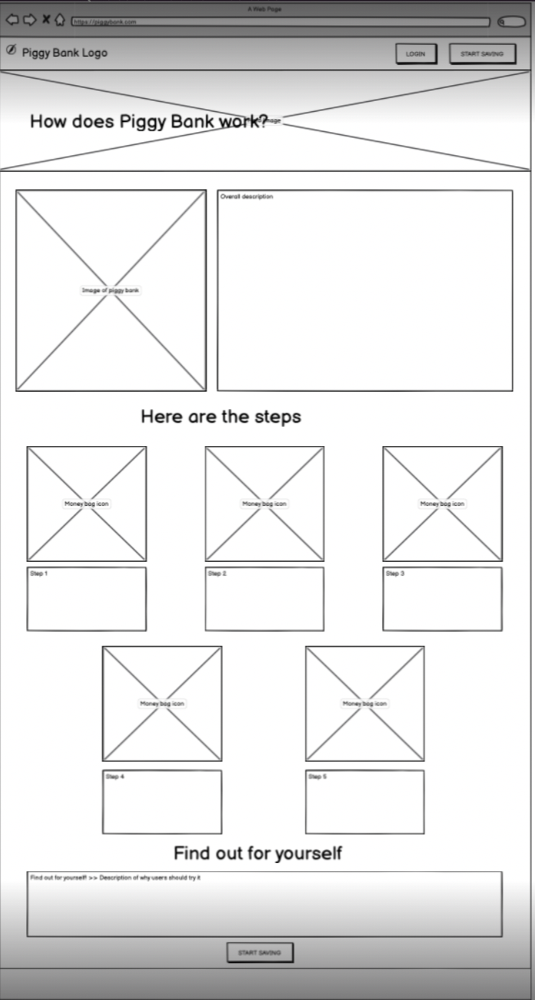
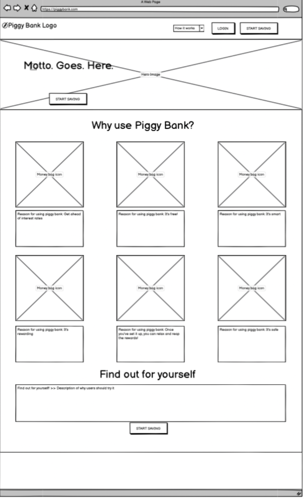
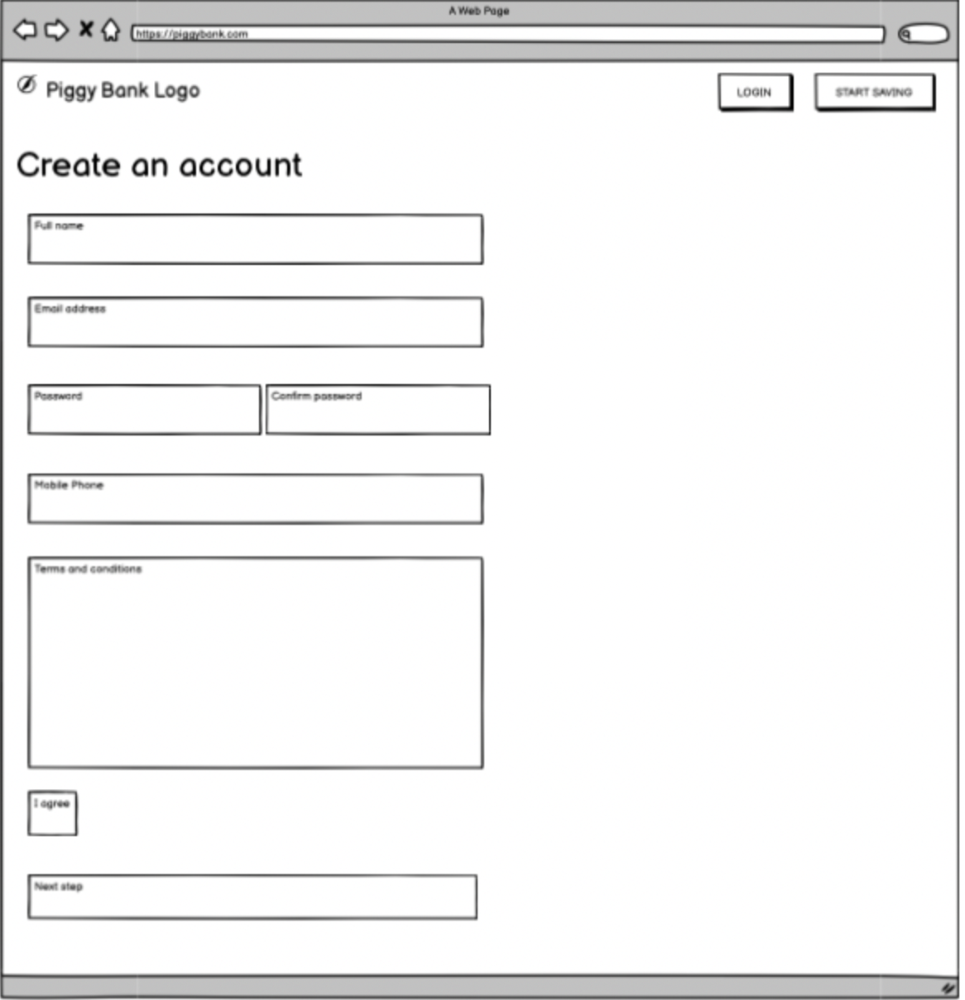
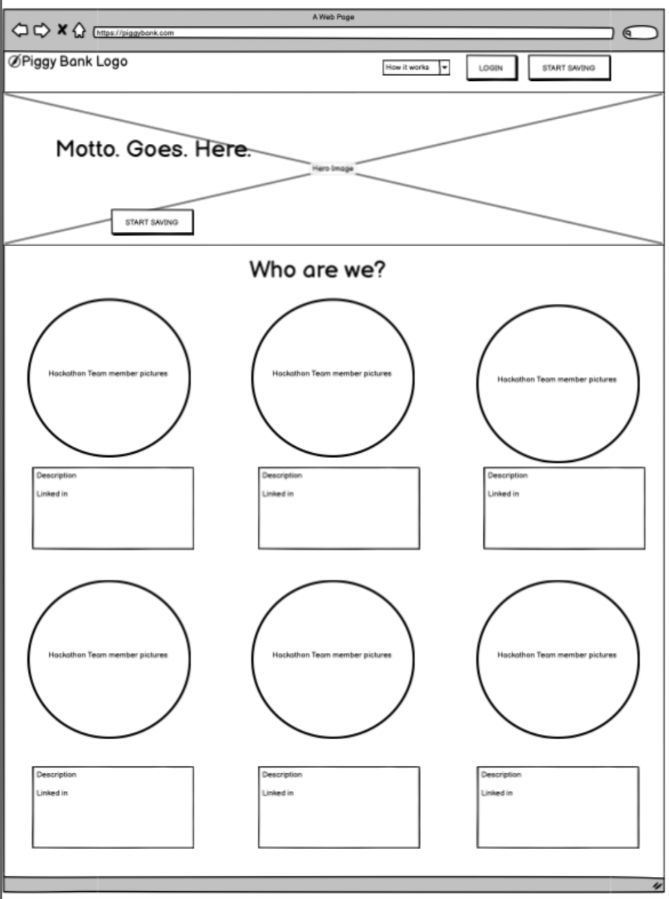

# Piggy Bank
​
## Team Name: <<team_name>>
​
[Link to Deployed Project](<<add_deployed_link_to_project_here>>)
​
## Contents(#contents)
​
* [About](#about)
  * [Target Audience](#targe-audience)
* [User Experience (UX)](#user-experience)
    * [User Stories](#user-stories)
* [Technology](#technology)
* [Design](#design)
  * [Color Scheme](#color-scheme)
  * [Typography](#typography)
  * [Imagery](#imagery)
  * [Wireframes](#wireframes)
* [Deployment & Usage](#deployment)
* [Testing](#testing)
* [Credits](#credits)
  * [Code](#code)
  * [Content](#content)
  * [Media](#media)
  * [Acknowledgements](#acknowledgements)
​
## About
This interactive web application is designed to help the user save money through each banking transaction. The app rounds down the change to the nearest whole currency and deposits the amount in a separate 'piggy bank' linked to a bank account of their choice using the account's IBAN.

Clicking the 'login' button will prompt the user to enter their credentials (username and password) and pass through a two-factor authentication before arriving to their personal dashboard. There they will be able to view previous transactions, view the account balance and toggle between categorized piggy banks. 

### Target Audience
Piggy Bank is designed for users with access to a bank account who want to save money after each transaction. Adults and children alike can interact with this easy-to-use application and track their savings through one or more accounts.

## User Experience
Our team thought about various banking apps already in use today to consider what featues we wanted Piggy Bank to have. What features are current applications lacking? How could they be improved? What do we want the main functionality of Piggy Bank to be? 

Ultimately, we wanted an easy-to-use web application that allows the user to deposit, transfer and withdraw money safely and without issue. The simplicity of the app also caters to younger users and those who are just learning the ins and outs of online banking. 
​
### User stories
Four categories of User Stories were used to plan the implementation of various features for the Piggy Bank App. They were prioritized as: "Must Have", "Should Have", "Could Have" and "Won't Have". 

All categories of User Stories were included in the fnial deployment of this version of the Piggy Bank Application, barring those labeled "Won't Have". They were not prioritized during the creation and deployment of this version of the app but may be included as future features.

The image below shows a template to create User Stories that will include the name of the Story, a brief descritpion, its title, one of four labels and what team member the Story is assigned to. 

The User Stories included in this edition of the app are:

|User Story |Image of the User Story completed|Label|
|-----------------------|---------------------------------|-----------
|[#1](https://github.com/Kaylaesmith1/jan23-hackathon-team12/issues/1) Create a new account| |Must Have||
|[#2](https://github.com/Kaylaesmith1/jan23-hackathon-team12/issues/2) Transfer money| |Must Have||
|[#3](https://github.com/Kaylaesmith1/jan23-hackathon-team12/issues/3) Check the account balance| |Must Have||
|[#4](https://github.com/Kaylaesmith1/jan23-hackathon-team12/issues/4) Deposit money| |Must Have||
|[#5](https://github.com/Kaylaesmith1/jan23-hackathon-team12/issues/5) Contact customer service| |Should Have||
|[#6](https://github.com/Kaylaesmith1/jan23-hackathon-team12/issues/6) Terms and Conditions| |Must Have||
|[#7](https://github.com/Kaylaesmith1/jan23-hackathon-team12/issues/7) Direct debit| |Could Have||
|[#8](https://github.com/Kaylaesmith1/jan23-hackathon-team12/issues/8) Make deposits using (the test version of) Stripe| |Must Have||
|[#9](https://github.com/Kaylaesmith1/jan23-hackathon-team12/issues/9) Footer with professional links| |Must Have||
|[#10](https://github.com/Kaylaesmith1/jan23-hackathon-team12/issues/10) Two-factor authentication| |Must Have||
|[#11](https://github.com/Kaylaesmith1/jan23-hackathon-team12/issues/11) Home page | |Must Have||
|[#12](https://github.com/Kaylaesmith1/jan23-hackathon-team12/issues/12) Login | |Must Have||
|[#13](https://github.com/Kaylaesmith1/jan23-hackathon-team12/issues/13) Separate deposits and withdrawals | |Could Have||
|[#14](https://github.com/Kaylaesmith1/jan23-hackathon-team12/issues/14) Automate payments| |Won't Have||
|[#15](https://github.com/Kaylaesmith1/jan23-hackathon-team12/issues/15) Mobile app at ATM | |Won't Have||
|[#16](https://github.com/Kaylaesmith1/jan23-hackathon-team12/issues/16) Session timeout| |Should Have||
|[#17](https://github.com/Kaylaesmith1/jan23-hackathon-team12/issues/17) Navigation bar| |Must Have||

## Technology:
​
<< Detail your techstack here, and why you chose it. >>
​
<< list your languages & tools below: >>
​
*  << languages >>
	* << list the langauge & reason for using it >>
​
* << tools >>
  * << list the tool & reason for using it >>
​
## Initial MVP idea:
​
Detail plans and scope of project here....
​
<< consider talking about how you planned as a team here and what tools were implemented >>
​
### Actual idea & content:
​
<< how does you final product/project match up to your initial mvp plans >>
​
<< detail idea / features / functionality here >>
​
## Design
​
### Color Scheme:
Our team decided on a royal blue color scheme with gray / silver accents to make it look professional yet entice users. The 5-color scheme is below.

​

### Typography:
<< what font pairings did your team consider and pick? And why? >>

Discuss w team

### Imagery:
In the top, left corner of each page, a small piggy bank icon is shown. Clicking it will direct the user back to the home page.

​

To illustrate the Home Page, we used an image of a golden piggy bank with stacks of $100 bills next to it. The two buttons, 'Get Started' and 'Live Demo' are laid over the image along with the words, "Piggy Bank a safe way to save".

​
​
<< ensure source attribution is maintained, and that you have used copyright free material >>

Discuss w team

​

### Wireframes:
​

- Mobile Wireframes:

​
<< put all your mobile wireframes here... >>
​
<< consider adding some notes to detail the planned components or functionality >>
​

​

- Desktop Wireframes:

​
In the first stages of planning, one of our team members designed wireframes outlining the pages of our web application. 

Each page includes the Navigation bar at the top with the app logo, a login and a 'start saving' button.

The team wanted to include a page detailing how the Piggy Bank app works with a description of the app, the steps and a bottom section to find out more about the app and why users should try it.

​

A page explaining why you should use Piggy Bank was included in the wireframe, too. This will show the benefits of using the app.

​

If a user wishes to sign up to use Piggy Bank, they can click on the 'Sign up' button in the nav bar and they'll be taken to a 'Create and account' page where they will need to fill out their user information to be able to log in to Piggy Bank. The information includes the user's full name, email address, a password (and confirmation of such), phone number and agreeing to the terms and conditions.

​

The About the Team page shows a picture of the six team members, their names and icons that link to their professional pages (GitHub and LinkedIn).

​
​

## Deployment
<< detail deployment methods used here, and any extraneous circumstances to run the project locally >>
​
## Testing
<< detail testing logs here - any known bugs, and squashed bugs 🐛🐛 >>
​
## Credits

### Code
<< any and all code that isn't yours...must go here >>

Team, did we use any code snippets?

​
### Content
To get an idea of pertinent User Stories for a savings app, we started by using a list of examples for the [UX on a mobile app](https://propelrr.com/blog/user-story-examples-fintech-apps#). From there we brainstormed other ways to improve the user experience and the Piggy Bank application itself.

A couple features were suggested as [user stories for mobile banking apps](https://blog.requstory.com/2021/12/06/user-stories-for-mobile-banking-app/) but were included as "Won't Have" user stories. They are features we could include in subsequent versions of the application.
​
### Media
To learn how the deposit, transfer and withdraw features would work for our application, we found and followed a [YouTube video](https://www.youtube.com/watch?v=SrT9Wf_OFyw) that showed us how to write our desired functions for our logic. We used that as a template to develop our own functions so the features we wanted in Piggy Bank would work.
​
### Acknowledgements
We would like to acknowledge and thank each member of our team for great team work and participation during this hackathon. As is customary for hackathons, our team comprised individuals of different coding levels but each member was able to contribute to the final project and development of our Piggy Bank app.

Thanks also to the hackteam and Code Institute. We appreciate your volunteering your time and expertise to help with any questions and clarifications we had throughout the project.

Team, add anything else you'd like to this section, or let me know and I can add it!
