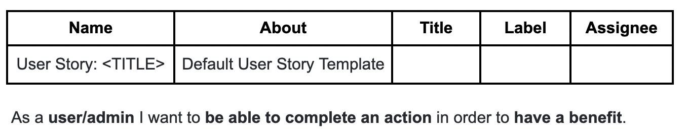

<h1>PIGGY BANK APP</h1>

View the work of Hackathon Team 12 [here.]("XX")

This interactive web application is designed to help the user save money through each banking transaction. The app rounds down the change to the nearest whole currency and deposits the amount in a separate 'piggy bank' linked to a bank account of their choice using the account's IBAN.

Clicking the 'login' button will prompt the user to enter their credentials (username and password) and pass through a two-factor authentication before arriving to their personal dashboard. There they will be able to view previous transactions, view the account balance and toggle between categorized piggy banks. 


<h2 text-align="center"></h2>

## Target Audience

Piggy Bank is designed for users with access to a bank account who want to save money after each transaction. Adults and children alike can interact with this easy-to-use application and track their savings through one or more accounts.


# User Experience (UX)
## User Stories
Four categories of User Stories were used to plan the implementation of various features for the Piggy Bank App. They were prioritized as: "Must Have", "Should Have", "Could Have" and "Won't Have". 

All categories of User Stories were included in the fnial deployment of this version of the Piggy Bank Application, barring those labeled "Won't Have". They were not prioritized during the creation and deployment of this version of the app but may be included as future features.

The image below shows a template to create User Stories that will include the name of the Story, a brief descritpion, its title, one of four labels and what team member the Story is assigned to. 




The User Stories included in this edition of the app are:

|User Story |Image of the User Story completed|Label|
|-----------------------|---------------------------------|-----------
|[#1](https://github.com/Kaylaesmith1/jan23-hackathon-team12/issues/1) Create a new account| |Must Have||

<div style="color:red;font-size:30px">

-   ### User stories

    -   #### First Time Visitor Goals

        1. As a First Time Visitor, I want to easily understand the main purpose of the site and learn more about the organisation.
        2. As a First Time Visitor, I want to be able to easily navigate throughout the site to find content.
        3. As a First Time Visitor, I want to look for testimonials to understand what their users think of them and see if they are trusted. I also want to locate their social media links to see their followings on social media to determine how trusted and known they are.

    -   #### Returning Visitor Goals

        1. As a Returning Visitor, I want to find information about coding challenges.
        2. As a Returning Visitor, I want to find the best way to get in contact with the organisation with any questions I may have.
        3. As a Returning Visitor, I want to find community links.

    -   #### Frequent User Goals
        1. As a Frequent User, I want to check to see if there are any newly added challenges or hackathons.
        2. As a Frequent User, I want to check to see if there are any new blog posts.
        3. As a Frequent User, I want to sign up to the Newsletter so that I am emailed any major updates and/or changes to the website or organisation.

-   ### Design
    -   #### Colour Scheme
        -   The two main colours used are Code Insititue red, and white.
    -   #### Typography
        -   The Montserrat font is the main font used throughout the whole website with Sans Serif as the fallback font in case for any reason the font isn't being imported into the site correctly. Montserrat is a clean font used frequently in programming, so it is both attractive and appropriate.
    -   #### Imagery
        -   Imagery is important. The large, background hero image is designed to be striking and catch the user's attention. It also has a modern, energetic aesthetic.

*   ### Wireframes

    -   Home Page Wireframe - [View](https://github.com/)

    -   Mobile Wireframe - [View](https://github.com/)

    -   Contact Us Page Wireframe - [View](https://github.com/)

## Features

-   Responsive on all device sizes

-   Interactive elements

## Technologies Used

### Languages Used

-   [HTML5](https://en.wikipedia.org/wiki/HTML5)
-   [CSS3](https://en.wikipedia.org/wiki/Cascading_Style_Sheets)

### Frameworks, Libraries & Programs Used

1. [Bootstrap 4.4.1:](https://getbootstrap.com/docs/4.4/getting-started/introduction/)
    - Bootstrap was used to assist with the responsiveness and styling of the website.
1. [Hover.css:](https://ianlunn.github.io/Hover/)
    - Hover.css was used on the Social Media icons in the footer to add the float transition while being hovered over.
1. [Google Fonts:](https://fonts.google.com/)
    - Google fonts were used to import the 'Titillium Web' font into the style.css file which is used on all pages throughout the project.
1. [Font Awesome:](https://fontawesome.com/)
    - Font Awesome was used on all pages throughout the website to add icons for aesthetic and UX purposes.
1. [jQuery:](https://jquery.com/)
    - jQuery came with Bootstrap to make the navbar responsive but was also used for the smooth scroll function in JavaScript.
1. [Git](https://git-scm.com/)
    - Git was used for version control by utilizing the Gitpod terminal to commit to Git and Push to GitHub.
1. [GitHub:](https://github.com/)
    - GitHub is used to store the projects code after being pushed from Git.
1. [Photoshop:](https://www.adobe.com/ie/products/photoshop.html)
    - Photoshop was used to create the logo, resizing images and editing photos for the website.
1. [Balsamiq:](https://balsamiq.com/)
    - Balsamiq was used to create the [wireframes](https://github.com/) during the design process.

<div style="color:green;font-size:20px">

## Testing

### Manual Testing

* In order to test our product for CRUD functionality (Create, Read, Update, and Delete), we created fake users to undergo manual testing. 

### Further Testing

-   The Website was tested on Google Chrome, Internet Explorer, Microsoft Edge and Safari browsers.
-   The website was viewed on a variety of devices such as Desktop, Laptop, iPhone7, iPhone 8 & iPhoneX.
-   A large amount of testing was done to ensure that all pages were linking correctly.
-   Friends and family members were asked to review the site and documentation to point out any bugs and/or user experience issues.

### Known Bugs

-   We had an account app which we needed to name "allauth", however upon doing this, we realised that we had two apps with this same name, which caused this bug to appear. 
    * To fix this bug, we renamed the account app to Piggyaccount and reset the migrations, by making a separate migration and renaming it accordingly. 
    * We also created a form to check if we could use the piggy bank models, which worked effectively. 

<div style="color:green;font-size:20px">
## Deployment

### Elephant SQL and Heroku

The project was deployed on Heroku using the following steps...

1. Firstly, we created an elephant SQL team, invited all members there on their platform and gave them access to see the SQL database. 
    * As members, we made sure the project could run locally from each team member's gitpod first by installing django with tailwind and showing the team how to run it. 
2. Following this, each team member made their individual branches for developing the project. The projecct would then be developed until it was at a stage each team member was satisfied with, before being pushed to the main branch. 
3. Towards the end of the project, each team member then set up their configuration variables for the staging part of the deployment in the env.py file. This allowed the team to connect it to heroku which was created in Owen's account.
4. Finally, we tested everything on the staging branch before deploying the main branch for the project to be hosted on Heroku. 

### Github Pages

The project was deployed on Heroku using the following steps...

1. Log in to GitHub and locate the [GitHub Repository](https://github.com/)
2. At the top of the Repository (not top of page), locate the "Settings" Button on the menu.
    - Alternatively Click [Here](https://raw.githubusercontent.com/) for a GIF demonstrating the process starting from Step 2.
3. Scroll down the Settings page until you locate the "GitHub Pages" Section.
4. Under "Source", click the dropdown called "None" and select "Master Branch".
5. The page will automatically refresh.
6. Scroll back down through the page to locate the now published site [link](https://github.com) in the "GitHub Pages" section.

### Forking the GitHub Repository

By forking the GitHub Repository we make a copy of the original repository on our GitHub account to view and/or make changes without affecting the original repository by using the following steps...

1. Log in to GitHub and locate the [GitHub Repository](https://github.com/)
2. At the top of the Repository (not top of page) just above the "Settings" Button on the menu, locate the "Fork" Button.
3. You should now have a copy of the original repository in your GitHub account. 

### Making a Local Clone

1. Log in to GitHub and locate the [GitHub Repository](https://github.com/)
2. Under the repository name, click "Clone or download".
3. To clone the repository using HTTPS, under "Clone with HTTPS", copy the link.
4. Open Git Bash
5. Change the current working directory to the location where you want the cloned directory to be made.
6. Type `git clone`, and then paste the URL you copied in Step 3.

```
$ git clone https://github.com/
```

7. Press Enter. Your local clone will be created.

```
$ git clone https://github.com/
> Cloning into `CI-Clone`...
> remote: Counting objects: 10, done.
> remote: Compressing objects: 100% (8/8), done.
> remove: Total 10 (delta 1), reused 10 (delta 1)
> Unpacking objects: 100% (10/10), done.
```

Click [Here](https://help.github.com/en/github/creating-cloning-and-archiving-repositories/cloning-a-repository#cloning-a-repository-to-github-desktop) to retrieve pictures for some of the buttons and more detailed explanations of the above process.

<div style="color:red;font-size:30px">
## Credits

### Code

-   The full-screen hero image code came from this [StackOverflow post](https://stackoverflow.com)

-   [Bootstrap4](https://getbootstrap.com/docs/4.4/getting-started/introduction/): Bootstrap Library used throughout the project mainly to make site responsive using the Bootstrap Grid System.

-   [MDN Web Docs](https://developer.mozilla.org/) : For Pattern Validation code. Code was modified to better fit my needs and to match an Irish phone number layout to ensure correct validation. Tutorial Found [Here](https://developer.mozilla.org/en-US/docs/Web/HTML/Element/input/tel#Pattern_validation)

### Content

-   All content was written by the developer.

-   Psychological properties of colours text in the README.md was found [here](http://www.colour-affects.co.uk/psychological-properties-of-colours)

### Media

-   All Images were created by the developer.

### Acknowledgements

-   My Mentor for continuous helpful feedback.

-   Tutor support at Code Institute for their support.