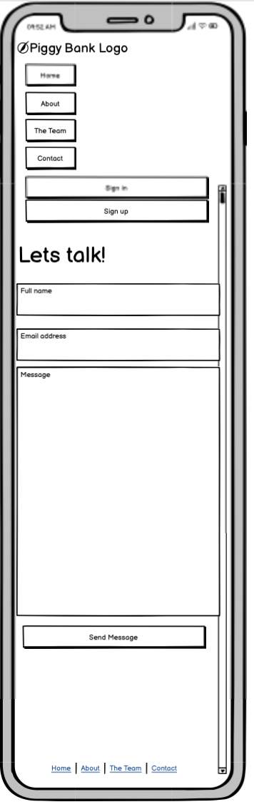
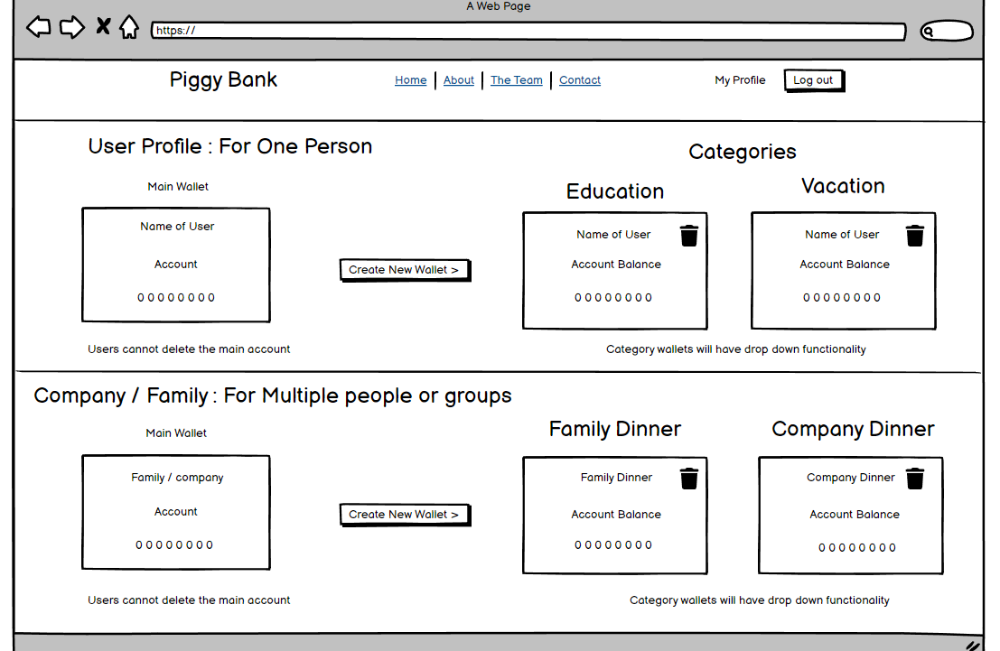

# Piggy Bank
​
## Team Name: Green Fund
​
[Link to Deployed Project](<<add_deployed_link_to_project_here>>)
​
## Contents(#contents)
​
* [About](#about)
  * [Target Audience](#targe-audience)
* [User Experience (UX)](#user-experience)
    * [User Stories](#user-stories)
* [Technology](#technology)
* [Design](#design)
  * [Color Scheme](#color-scheme)
  * [Typography](#typography)
  * [Imagery](#imagery)
  * [Wireframes](#wireframes)
* [Deployment & Usage](#deployment)
* [Testing](#testing)
* [Credits](#credits)
  * [Code](#code)
  * [Content](#content)
  * [Media](#media)
  * [Acknowledgements](#acknowledgements)
​
## About
This interactive web application is designed to help the user save money through each banking transaction. The app rounds down the change to the nearest whole currency and deposits the amount in a separate 'piggy bank' linked to a bank account of their choice using the account's IBAN.

Clicking the 'login' button will prompt the user to enter their credentials (username and password) and pass through a two-factor authentication before arriving to their personal dashboard. There they will be able to view previous transactions, view the account balance and toggle between categorized piggy banks. 

### Target Audience
Piggy Bank is designed for users with access to a bank account who want to save money after each transaction. Adults and children alike can interact with this easy-to-use application and track their savings through one or more accounts.

## User Experience
Our team thought about various banking apps already in use today to consider what featues we wanted Piggy Bank to have. What features are current applications lacking? How could they be improved? What do we want the main functionality of Piggy Bank to be? 

Ultimately, we wanted an easy-to-use web application that allows the user to deposit, transfer and withdraw money safely and without issue. The simplicity of the app also caters to younger users and those who are just learning the ins and outs of online banking. 
​
## User stories
Four categories of User Stories were used to plan the implementation of various features for the Piggy Bank App. They were prioritized as: "Must Have", "Should Have", "Could Have" and "Won't Have". 

All categories of User Stories were included in the fnial deployment of this version of the Piggy Bank Application, barring those labeled "Won't Have". They were not prioritized during the creation and deployment of this version of the app but may be included as future features.

The image below shows a template to create User Stories that will include the name of the Story, a brief descritpion, its title, one of four labels and what team member the Story is assigned to. 

The User Stories included in this edition of the app are:
### New User Goals

|User Story Title |Story Description |Label|
|-----------------------|---------------------------------|-----------
|[#1](https://github.com/Kaylaesmith1/jan23-hackathon-team12/issues/1) Create a new account| As a **user/admin** I want to be able to **create a new account** so I can **easily view my transactions and account information online**.|Must Have||
|[#2](https://github.com/Kaylaesmith1/jan23-hackathon-team12/issues/2) Transfer money| As a **user/admin** I want to be able to **transfer money to/from/between my account(s)** so I can **easily manage my finances and allocate funds to specific accounts**.|Must Have||
|[#3](https://github.com/Kaylaesmith1/jan23-hackathon-team12/issues/3) Check the account balance| As a **user/admin** I want to be able to **check the current balance of my accounts** so I can **regularly be kept abreast of my financial status**.|Must Have||
|[#4](https://github.com/Kaylaesmith1/jan23-hackathon-team12/issues/4) Deposit money| As a **user/admin** I want to be able to **directly deposit funds into my account** so I can **add cash easily and safely without leaving home**.|Must Have||
|[#5](https://github.com/Kaylaesmith1/jan23-hackathon-team12/issues/5) Contact customer service| As a **user/admin** I want to be able to **contact customer service representatives** so I can **get any questions or problems I have resolved quickly**.|Should Have||
|[#6](https://github.com/Kaylaesmith1/jan23-hackathon-team12/issues/6) Terms and Conditions|As a **user/admin** I want to be able to **read the terms and conditions / banking policies** so I can **minimize transaction errors**. |Must Have||
|[#7](https://github.com/Kaylaesmith1/jan23-hackathon-team12/issues/7) Direct debit| As a **user/admin** I want to be able to **directly debit from this account** so I can **easily pay my bills online**.|Could Have||
|[#8](https://github.com/Kaylaesmith1/jan23-hackathon-team12/issues/8) Make deposits using (the test version of) Stripe| As a **user/admin** I want to **be able to use (the testing version of) Stripe** so I can **make deposits into my accounts**.|Must Have||
|[#9](https://github.com/Kaylaesmith1/jan23-hackathon-team12/issues/9) Footer with professional links| As a **user/admin** I want to **be able to easily see professional links in the footer** in order to **connect with the Piggy Bank**. |Must Have||
|[#10](https://github.com/Kaylaesmith1/jan23-hackathon-team12/issues/10) Two-factor authentication| As a **user/admin** I want to **have two factor authorization and authentication** to ensure **my identity is protected online**.|Must Have||
|[#11](https://github.com/Kaylaesmith1/jan23-hackathon-team12/issues/11) Home page |As a **user/admin** I want to **see an easy-to-use Home Page** in order to **navigate the app quickly**.|Must Have||
|[#12](https://github.com/Kaylaesmith1/jan23-hackathon-team12/issues/12) Login |As a **user/admin** I want to **be able to log in** in order to **view my account information easily**.|Must Have||
|[#13](https://github.com/Kaylaesmith1/jan23-hackathon-team12/issues/13) Separate deposits and withdrawals |As a **user/admin** I want to **be able to filter between deposits and withdrawals** in order to **see those transactions separately**.|Could Have||
|[#14](https://github.com/Kaylaesmith1/jan23-hackathon-team12/issues/14) Automate payments|As a **user/admin** I want to **update my payment details** so **automatic payments can be direct debited**.|Won't Have||
|[#15](https://github.com/Kaylaesmith1/jan23-hackathon-team12/issues/15) Mobile app at ATM |As a **user/admin** I want to **be able to use the mobile app at an ATM** in order to **avoid carrying a physical debit card**.|Won't Have||
|[#16](https://github.com/Kaylaesmith1/jan23-hackathon-team12/issues/16) Session timeout| As a **user/admin** I want **my session to time out after being idle for 1 minute** in order to **keep my account information private**.|Should Have||
|[#17](https://github.com/Kaylaesmith1/jan23-hackathon-team12/issues/17) Navigation bar|As a **user/admin** I want **a navigation bar at the top of each page** so I **can easily toggle between pages of the application**.|Must Have||

## Technology:
​Our team combined a few different languages and web tools to create the Piggy Bank application. A list of those included in the project are below.

*  Languages:
	* [HTML5](https://en.wikipedia.org/wiki/HTML5)
   * [CSS3](https://en.wikipedia.org/wiki/Cascading_Style_Sheets)
   * [JavaScript](https://en.wikipedia.org/wiki/JavaScript)

​
* Tools
  * [Tailwind CSS](https://tailwindcss.com/docs/responsive-design)
    - Tailwind CSS was used to improve the responsiveness and styling of the application.
  * [Balsamiq](https://balsamiq.com/)
    - Balsamiq was used to create wireframes during the initial design process.
  * [Django](https://www.djangoproject.com/)
    - The Django framework was used to quickly and seamlessly develop our app. It [integrates easily with Tailwind CSS](https://www.section.io/engineering-education/how-to-integrate-django-tailwind-styling-in-an-application/), which was an important aspect of this project. A [YouTube video](https://www.youtube.com/watch?v=GepQBpHNgrk) was also helpful in learning how to integrate the two.
  * [Icons8](https://icons8.com/icons/set/piggybank)
    - We found a piggy bank icon from Icons8 to add to our application.
  * [Exchangerates](https://exchangeratesapi.io/)
    - This is one of the APIs we researched to include for currency exchange.
  * [Stripe](https://stripe.com/ie)
    - Stripe was used for transactions between wallets that users create.
  * [ElephantSQL](https://www.elephantsql.com/)
    - ElephantSQL was used to create the database for Piggy Bank.
  * [Heroku](https://www.heroku.com/)
    - Heroku was used for hosting the Piggy Bank app.
  * [Git](https://git-scm.com/)
    - Git was used along with the [Gitpod](https://www.gitpod.io/) terminal for each team member to commit and push their work into the global staging branch of the app on GitHub. This helped with version control and to avoid branch develoment issues.
  * [GitHub:](https://github.com/)
    - GitHub was used to save versions of the code for the entire project after each branch was pushed from Git. There, the scrum master dealt with pull requests from team members and merged the branches.
​
## Initial MVP idea:
​
Our team wanted to create a banking app that would allow the user to save money in one or more virtual wallets. The user would be able to log into their account using 2FA authentication and view the transaction history of the account, make deposits or withdrawals and easily transfer money between accounts. The goal of the app is to have banking information readily visible at the user's fingertips and facilitate saving money. On creating an account, the user can choose whether they're an invidiual customer or a family or corporate account.
​
As a team we had an initial call with all team members to outline basic features we agreed were important for the functionality of the app. We brainstormed how these could be implemented and all participated in doing research on tools to use to ensure the features worked successfully. Those tools are listed in detail in the Technology section above.
​
### Actual idea & content:
​
The final Piggy Bank application is quite similar to what we discussed as a group and outlined in our wireframes at the outset. We were able to implement features like creating a new account, signing in with 2FA authentication and contacting customer service by filling out a form.
​
## Design
​
### Color Scheme:
Our team decided on a royal blue color scheme with gray / silver accents to make it look professional yet entice users. The 5-color scheme is below.

​

### Typography:
As per this month's Hackathon requirements of branching out from Bootstrap, we chose to implement Tailwind CSS into Piggy Bank. We then decided to stick with the default font style. It's a clear, bold font that's easily legible in various sizes on our pages.

### Imagery:
In the top, left corner of each page, a small piggy bank icon is shown. Clicking it will direct the user back to the home page.

​

To illustrate the Home Page, we used an image of a golden piggy bank with stacks of $100 bills next to it. The two buttons, 'Get Started' and 'Live Demo' are laid over the image along with the words, "Piggy Bank a safe way to save".

​

We created a custom color palette using various shades of royal blue and grey, which made the gold accents on our pages pop. To do this, we used the [Coolers website](https://coolors.co/7681e2-6366f1-4337c9-374151-6b7280) and tweaked the colors by adjusting the hex codes to create the [custom template](https://coolors.co/7681e2-6366f1-4337c9-374151-6b7280), also shown in the 'Color Scheme' section above.
​
<< ensure source attribution is maintained, and that you have used copyright free material >>

​

### Wireframes:
​

- Mobile Wireframes:

All pages of the Piggy Bank app will have a navigation bar complete with the Piggy Bank logo and clicable links for: Home, About, The Team and Contact Us. A footer is also on each page with the same links.

​The Home Page is shown below with the navigation bar vertically with buttons to sign in or sign up for the app underneath. The application is explained briefly in the lower third of the page.

​

The About Page shows login information and three steps a user needs to understand how the Piggy Bank works. Below, there is an informational video that explains the application in more detail.

​

The Team Page introduces the Piggy Bank team, complete with each team member's name, a photo and links to their GitHub and LinkedIn.

​

The Contact Page invites the user to get in touch, asking for their name, email and a brief message.

​

​As a team, we discussed how to add basic features like clickable links, the contact form and a sign up section. We also used 2FA authentication, which we felt was important to ensure the user's privacy and protect against fraudulent logins. 
​

​

- Desktop Wireframes:

​
Following the Agile methodology, in the first stages of planning, one of our team members designed wireframes outlining the pages of our web application. 

Each page includes the Navigation bar at the top with the app logo, a login and a 'start saving' button as well as clickable links for the Home, About, The Team and Contact Us pages.

The Home Page shows the hero image with the buttons 'Get Started' and 'Live Demo' superimposed. Further down, three horizontal cards explain how the Piggy Bank app works and why it's a safe option for saving.

​

The About Page outlines three steps for a new user to understand how Piggy Bank works. Further down, an informational video is available for a more in-depth explanation of the app.

​

The Contact Us page invites the user to get in touch with Piggy Bank by filling out a simple contact form. The user is asked to enter their name, email and a brief message.

​​

The About the Team page shows a picture of the six team members, their names and icons that link to their professional pages (GitHub and LinkedIn).

The user's dashboard page will show the account information for that user, as an indivitual or as a group (family / corporate user) and lists the categories of savings. Clicking the 'create new wallet' button will allow the user to create their wallet.

​
​

## Deployment
<< detail deployment methods used here, and any extraneous circumstances to run the project locally >>
​
## Testing
<< detail testing logs here - any known bugs, and squashed bugs 🐛🐛 >>
​
## Credits

### Code
<< any and all code that isn't yours...must go here >>
​
### Content
To get an idea of pertinent User Stories for a savings app, we started by using a list of examples for the [UX on a mobile app](https://propelrr.com/blog/user-story-examples-fintech-apps#). From there we brainstormed other ways to improve the user experience and the Piggy Bank application itself.

A couple features were suggested as [user stories for mobile banking apps](https://blog.requstory.com/2021/12/06/user-stories-for-mobile-banking-app/) but were included as "Won't Have" user stories. They are features we could include in subsequent versions of the application.
​
### Media
To learn how the deposit, transfer and withdraw features would work for our application, we found and followed a [YouTube video](https://www.youtube.com/watch?v=SrT9Wf_OFyw) that showed us how to write our desired functions for our logic. We used that as a template to develop our own functions so the features we wanted in Piggy Bank would work.
​
### Acknowledgements
We would like to acknowledge and thank each member of our team for great team work and participation during this hackathon. As is customary for hackathons, our team comprised individuals of different coding levels but each member was able to contribute to the final project and development of our Piggy Bank app.

Thanks also to the hackteam and Code Institute. We appreciate your volunteering your time and expertise to help with any questions and clarifications we had throughout the project.